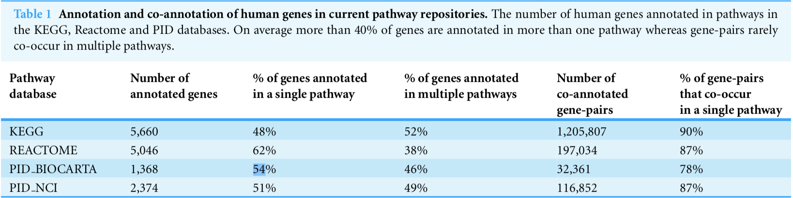

```{r include=FALSE}
library(WebGestaltR)
library(sigora)
library(tidyverse)
library(org.Hs.eg.db)
library(enrichR)
```


# `WebGestaltR` package

- Avalaible on: CRAN

- Last maintained: 05/2017

- Requires internet connection

- "Batch" method is sequential, hence slow

- No ID mapping necessary

- ORA & GSEA possible

- 12 organisms, 73 identifiers

- Already in use

```{r WebGestaltR, size='tiny'}
listOrganism()
```

[\textcolor{blue}{Reference Manual}](https://cran.r-project.org/web/packages/WebGestaltR/WebGestaltR.pdf)

# `WebGestaltR` package

```{r WebGestaltR Example, eval=TRUE}
load("Figures/webGestaltExample.rda")
colnames(webGestaltExample$webgestaltResults)
```

# `FGNet` package

- Avalaible on: Bioconductor

- Last maintained: 10/2018

- For offline use: Install database packages (!)

- ID mapping necessary

- GSEA only

[\textcolor{blue}{Reference Manual}](https://bioconductor.org/packages/release/bioc/manuals/FGNet/man/FGNet.pdf)

# `HTSanalyzeR` package

- Avalaible on: Bioconductor

- Last maintained: 2013/09 (!)

- For offline use: Install database packages

- ID mapping necessary

- ORA & GSEA

[\textcolor{blue}{Reference Manual}](http://bioconductor.org/packages/release/bioc/manuals/HTSanalyzeR/man/HTSanalyzeR.pdf)

# `sigora` package

- Avalaible on: CRAN

- Last maintained: 09/2018

- Works online, however no uploads required

- ID mapping necessary

- ORA & signature ORA (adapted ORA method, supposedly less prone to false positive hits)

- Human & mouse only

- Background in terms of experiment specific gene pair signatures

[\textcolor{blue}{Reference Manual}](https://cran.r-project.org/web/packages/sigora/sigora.pdf)

# `sigora` package

```{r eval=FALSE}
##query list
ils <- grep("^IL", idmap[["Symbol"]], value = TRUE)

## using precompiled GPS repository:
sigRes.ilreact <- sigora(queryList = ils,
                         GPSrepo = reaH,
                         level = 3)

## user created GPS repository:
nciH <- makeGPS(pathwayTable = nciTable)
sigRes.ilnci <- sigora(queryList = ils,
                       GPSrepo = nciH,
                       level = 2)

## user defined weighting schemes :
myfunc <- function(a, b) 1 / log(a + b)
sigora(
  queryList = ils,
  GPSrepo = nciH,
  level = 2,
  weighting.method = "myfunc"
)
```

# `SetRank` package

- Avalaible on: CRAN

- Last maintained: 2016/05 (!)

- For offline use: Install database packages

- ID mapping necessary

- GSEA only

[\textcolor{blue}{Reference Manual}](https://cran.r-project.org/web/packages/SetRank/SetRank.pdf)

# `STRINGdb` package

- Avalaible on: Bioconductor

- Last maintained: 2016/03 (!)

- Online use only

- ID mapping necessary, but provided via `STRINGdb`

- GSEA only

[\textcolor{blue}{Reference Manual}](https://bioconductor.org/packages/release/bioc/manuals/STRINGdb/man/STRINGdb.pdf)

# `enrichR` package

- Available on: CRAN

- Last maintained: 2017/04

- R interface for web based tool

- No ID mapping necessary

- No background specifiable

- ORA/GSEA

[\textcolor{blue}{Reference Manual}](https://cran.r-project.org/web/packages/enrichR/enrichR.pdf)

# Comparison

\begin{table}[]
\resizebox{\columnwidth}{!}{%
\begin{tabular}{ccccccc}
\hline
\textbf{Package} & \textbf{Provider} & \textbf{Maintainance} & \textbf{Offline} & \textbf{ID Mapping} & \textbf{ORA} & \textbf{GSEA} \\ \hline
WebGestaltR      & CRAN              & + (09/2019)          & --               & +                   & +            & +             \\
FGNet            & Bioc              & +                    & (--)             & (--)               & --            & +             \\
HTSanalyzeR      & Bioc              & --                   & (--)             & --                & +            & +             \\
sigora           & CRAN              & +                    & +                & (--)                & +            & --             \\
SetRank          & CRAN              & --                   & (--)             & --              & --            & +             \\
STRINGdb         & Bioc              & +                    & --               & (--)               & +            & +             \\
enrichR          & CRAN              & +                    & --               & +                  & (+)          & +              \\ \hline
\end{tabular}%
}
\end{table}

# Signature Overrepresentation Analysis (sigora)

Pathway gene-pair signatures (GPS)

- Pairs of genes that -- as a combination -- are *specific* to a single pathway.

- Weighted according to co-occurence scheme of each gene (considered *separately*) in a GPS.



You can find the article [\textcolor{blue}{here}](https://peerj.com/articles/229.pdf).

# Simulation

```{r message=FALSE, echo=TRUE, eval=FALSE, size="tiny"}
data(kegH)
a1 <-
  genesFromRandomPathways(
    GPSrepo = kegH,
    np = 3, # From np random pathways
    ng = 50,# Draw nq genes at random
    seed = 13
  )

# canonical ORA method on random geneset
ora_out <- ora(a1[["genes"]], kegH) %>% nrow

# signature ORA method on random geneset
sigora_out <- sigora(
  GPSrepo = kegH,
  queryList = a1[["genes"]],
  level = 4
)[[1]] %>% filter(Bonferroni <= 0.05) %>% nrow
```

```{r include=FALSE}
data(kegH)
a1 <-
  genesFromRandomPathways(
    GPSrepo = kegH,
    np = 3, # From np random pathways
    ng = 50,# Draw nq genes at random
    seed = 13
  )

# canonical ORA method on random geneset
ora_out <- nrow(ora(a1[["genes"]], kegH))

# signature ORA method on random geneset
sigora_out <- sigora(
  GPSrepo = kegH,
  queryList = a1[["genes"]],
  level = 4
)[[1]] %>% filter(Bonferroni <= 0.05) %>% nrow
```

ORA (w/o background) yields `r ora_out` ($>3$) matches, sigora yields "only" `r sigora_out` ($\leq 3$) matches, however no false positives.

# Simulation

```{r fig.align='center', fig.cap="Comparison of ORA and sigORA. Number of significantly enriched pathways after randomly selecting 50 genes from three pathways from the KEGG database. Number of replicates: 100, P-value correction: Bonferroni.", fig.height=3.5, fig.width=3.5, echo=FALSE}
load(file = "Figures/simulation_sigora.Rda")
par(mex=0.8)
boxplot(sim_out, ylab = "# enriched pathways", pch = 20, las = 1)
```

# Comparison of `WebGestaltR` ORA, `sigORA` & `enrichR` (pulldown dataset)

```{r echo=FALSE, message=FALSE, warning=FALSE, include=FALSE}
load("Figures/webGestaltExample.rda")

ref <-
  select(
    org.Hs.eg.db,
    columns = c("SYMBOL", "UNIPROT"),
    keys = as.character(webGestaltExample$reference_list$rownames.quant_data.),
    keytype = "UNIPROT",
    multiVals = "first"
  )

targ <-
  select(
    org.Hs.eg.db,
    columns = c("SYMBOL"),
    keys = as.character(webGestaltExample$clusterIDs$colID[webGestaltExample$clusterIDs$clusterID ==
                                                             1]),
    keytype = "UNIPROT",
    multiVals = "first"
  )

colnames(ref) <- c("Uniprot", "Symbol")

## using precompiled GPS repository:
sigRes <- sigora(queryList = targ$SYMBOL,
                         GPSrepo = kegH,
                         level = 3)

webGestaltExample$webgestaltResults[, c("geneset")]
```

- `WebGestaltR` (with specified background)

```{r echo=FALSE}
webGestaltExample$webgestaltResults[, c("geneset", "PValue")] ## WebGestaltR
```

- `sigora` (no background specified)

```{r echo=FALSE}
sigRes$summary_results[sigRes$summary_results$pvalues < 0.05, c("pathwy.id", "pvalues")] ## sigora
```

- `enrichR` (no background specified)

```{r message=FALSE, echo=FALSE}
load("Figures/enrichR.Rda")
out[[1]] %>% filter(Adjusted.P.value <= 0.05) %>% dplyr::select(Term, Adjusted.P.value)
```

# Conclusion

- `sigora` is limited to human/mouse

    - background specification: computationally intensive

- `WebGestaltR` 2019 version up and running

    - Significantly enhanced processing speed
    
    - no ID mapping necessary (support uniprot/swissprot)
    
- If ID mapping is necessary, best option is: `AnnotationDbi::mapIds`
