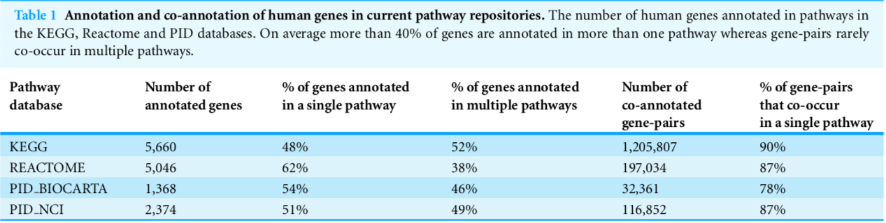
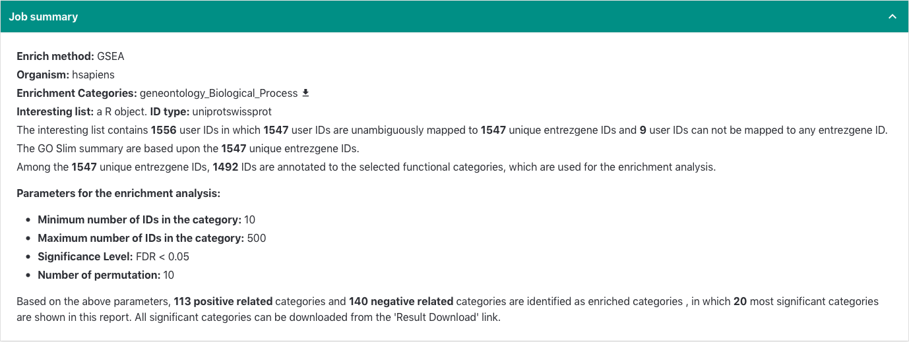
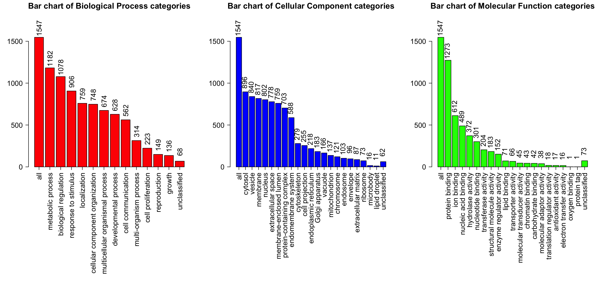
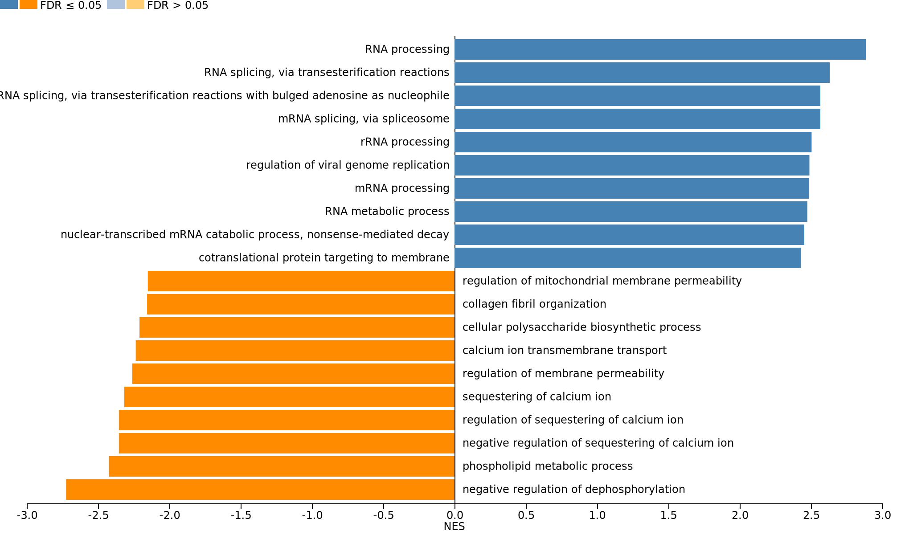

```{r setup, include=FALSE}
library(tidyverse)
```

## Outline

- Over-representation analysis (ORA)
- Signature over-representation analysis (sigORA)
- Gene set enrichment analysis (GSEA)
- Aim of the package
- Structure of the generated reports


# ORA | Over-representation analysis

## ORA Workflow

```{r echo=FALSE, fig.height=3, fig.align='center'}
plotdat <- data.frame(
  x = c(0, 2, 2, 4, 6)*1.5,
  y = c(0, 2, -2, 0, -0),
  lb = c("Protein Intensity \n Matrix", "(Clustering)", "Threshold", "Differentially \nregulated Set", "ORA")
)

ggplot(plotdat) +
  theme_void() +
  xlim(-1, 10) +
  ylim(-3, 3) +
  geom_segment(aes(x = c(0, 0, 2, 2, 4)*1.5, y = c(0, 0, 2, -2, 0), xend = c(2, 2, 4, 4, 6)*1.5, yend = c(2, -2, 0, 0, 0)), colour = "grey", alpha = 0.3) +
  geom_label(aes(x = x, y = y, label = lb), size = 5, fill = "lightgrey")
```

- (Hierarchical Clustering)
- Apply simple threshold (e.g. $\log_2{\mathrm{FC}}>0.5$, $p < 0.01$, $\dots$)
- Perform ORA with background specification

## ORA _vs_ GSEA

```{r echo=FALSE, results='asis'}
set.seed(666)
dat <- data.frame(
  ID = paste0("P", floor(runif(20, 1000, 9999))),
  Score = runif(20, -3, 3)
) %>% 
  mutate(` ` = "", `  ` = case_when(
    Score > 1 ~ "Differential",
    Score < 1 ~ "Non-differential"
  )) %>% 
  distinct(ID, .keep_all = TRUE) %>% 
  arrange(desc(Score))

dat  %>% 
  knitr::kable(digits = 2, format = "html") %>% 
  kableExtra::kable_styling(bootstrap_options = "striped", full_width = TRUE, position = "float_right", font_size = 16) %>% 
  kableExtra::row_spec(which(dat$Score > 1), color = "red") %>% 
  kableExtra::collapse_rows(columns = 3:4, valign = "middle") %>% 
  kableExtra::add_footnote(label = "\n Background consists of full list.", notation = "none")
```

ORA

- List of IDs sorted by some score
- Apply simple threshold (e.g. Score > 1) 
    
    $\rightarrow$ Differentially regulated set + background
    
- Perform Fisher's Exact Test

GSEA

- List of IDs sorted by some score
- Give **full** information to GSEA
- Compute enrichment scores


## Fisher's Exact Test

For a given pathway we have

- Pathway size
- Number of proteins of this pathway in the differentially regulated subset
- Number of proteins of this pathway in the background

```{r echo=FALSE}
tab <- matrix(c(12, 3, 7, 24), nrow = 2, byrow = TRUE)
dimnames(tab) <- list("GO Term" = c("Contained", "Not Contained"),
                      "Differentially expressed" = c("    Yes    ", "    No    "))

cat("Pathway GO:0003091")
tab
cat("p-value:", round(fisher.test(tab)$p.value, 5))
```


## Disadvantages of ORA

- Redundancy: No 1:1 relation between proteins and pathways

- Multiplicity: *p*-value adjustment (i.e. via FDR)

# sigORA | Signature over-representation analysis

## Gene Pair Signatures

- Introduced by @Foroushani2013 
- Search background and pathways for protein pairs unique to a given pathway

```{r out.width="800px", echo=FALSE, fig.align='center'}

```

- Afterwards conduct ORA using self-defined GPS repository

## Properties of sigORA

- Compares weighted number of observed pairs of proteins (unique to a single pathway) in the differentially regulated subset to the number one would expect to show up in the specified background

- Background GPS repository can change for each experiment

- Fairly conservative in terms of hits

# GSEA | Gene Set Enrichment Analysis

## GSEA `WebGestaltR`

- Introduced by @Subramanian15545

- Using the `WebGestaltR` package [@webgestpkg]

```{r out.width="800px", echo=FALSE, fig.align='center'}

```

- Compares the enrichment of particular protein set members towards the upper and lower end of the provided ranked protein list

- For instance ranked by *p*-value, FDR, fold change

## GSEA `WebGestaltR`

Enrichment plots for all pathways

<center>
```{r out.width="400px", echo=FALSE, fig.align='center'}

```
</center>


## GSEA `WebGestaltR`

GO slim summary

```{r out.width="800px", echo=FALSE, fig.align='center'}

```

## GSEA `WebGestaltR`

Barchart with enriched pathways

```{r out.width="800px", echo=FALSE, fig.align='center'}

```


## Disadvantages of `WebGestaltR`

- Online tool (connection issues)
- Last update to WebGestalt2019 broke a lot of `R` code
- Again last update to version 0.4.0 broke a lot of `R` code
- Permutation test involved $\rightarrow$ time consuming
    
    $\rightarrow$ limited reproducibility since no control over RNG seed

# `fgczgseaora` | Package

## Implemented functionalities

- `sigora` ORA \& sigORA: `runSIGORA()`

- `WebGestaltR` ORA: `runWebGestaltORA()`

- `WebGestaltR` GSEA: `runGSEA()`

<div class="notes">
So why write wrappers and additional functionalities around the existing packages?

* `sigORA`: 

    Hard to set up GPS repository
    
    ID mapping missing (UniProt $\rightarrow$ ENTREZ)
    
    Check ID mapping efficiency

* `WebGestaltR`:

    More convenient reporting
    
</div>


# `fgczgseaora` | Report structure

## Folder hierarchy

`Folder` -- Contrast

  - `Folder` -- Method + Target

    - `html` -- report
    - `Rmd` -- source file
    - `WebGestaltR` -- reports from `WebGestaltR`

## ORA, sigORA & GSEA

Example report


<style>
slides > slide { overflow: scroll; }
slides > slide:not(.nobackground):after {
  content: '';
}
slides > slide:not(.nobackground):before {
  background: none;
}
</style>

## References

